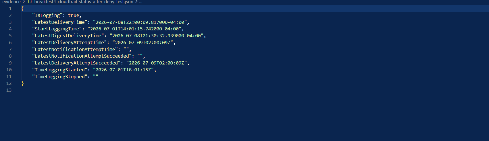
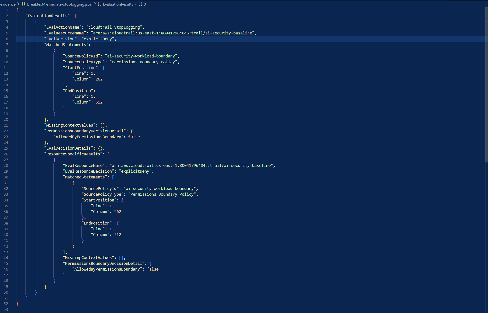

# AI Security Cloud Baseline

## Overview

This project implements a secure AWS cloud baseline for AI workloads using Terraform.

The goal of this project is to build the cloud security foundation required before deploying LLM applications, RAG systems, AI agents, or Bedrock-based workloads in AWS.

The baseline focuses on:

- Identity boundaries
- Least privilege IAM
- Encryption by default
- Secrets management
- CloudTrail audit logging
- S3 and CloudWatch visibility
- VPC egress restriction
- Cost anomaly detection
- Break/fix security validation

This project was built as a production-style security engineering lab and validated through controlled break/fix testing.

---

## Why This Project Matters

AI workloads introduce new cloud security risks.

A compromised AI agent or LLM-backed application may attempt to:

- Access sensitive S3 data
- Retrieve secrets
- Abuse Bedrock model invocation
- Generate excessive cloud cost
- Write unencrypted data
- Move laterally using IAM permissions
- Disable logging or monitoring
- Exfiltrate data over unrestricted egress paths

This baseline reduces those risks by enforcing secure cloud guardrails before AI workloads are deployed.

---

## Architecture Summary

The baseline is built around a restricted AI workload role.

The workload role is allowed to perform only approved actions required for AI workload execution, such as:

- Bedrock model invocation
- S3 object read/write
- Secrets Manager read access
- KMS decrypt and data key generation
- CloudWatch log stream creation
- CloudWatch log event publishing

Administrative actions such as IAM user creation, role assumption, CloudTrail stop logging, and unrestricted network egress are denied or restricted.

---

## Controls Implemented

| Module | Control | Purpose |
|---|---|---|
| Module 1 | IAM Permission Boundary | Restricts AI workload permissions to approved actions |
| Module 2 | KMS Key Separation | Creates separate encryption keys for logs, secrets, and storage |
| Module 3 | Secrets Manager | Stores application secrets using KMS encryption |
| Module 4 | CloudTrail | Enables management and data event logging |
| Module 5 | VPC + Egress Allowlist | Restricts outbound traffic and supports private Bedrock access |
| Module 6 | CloudWatch Logs | Creates encrypted log groups for app, model, and tool telemetry |
| Module 7 | Account Defaults | Enables S3 public access block and EBS encryption by default |
| Module 8 | Budgets + SNS + Cost Anomaly Detection | Detects cost spikes, agent loops, and runaway usage |

---

## Break/Fix Validation

The baseline was validated through controlled break/fix testing.

| Test | Objective | Expected Result | Status |
|---|---|---|---|
| Break Test 1 | Unexpected AssumeRole attempt | AccessDenied and CloudTrail visibility | Completed |
| Break Test 2 | Leaked-key simulation | CreateAccessKey and DeleteAccessKey visible in CloudTrail | Completed |
| Break Test 3 | PutObject without server-side encryption | AccessDenied and S3 data event captured | Completed |
| Break Test 4 | Stop CloudTrail from workload role | ExplicitDeny from Permission Boundary | Completed |

The break/fix testing proved that the controls were not only deployed, but enforceable.

---

## Key Security Outcomes

This project validates the following security outcomes:

- AI workload role is restricted by IAM Permission Boundary
- Unauthorized role assumption attempts are denied
- IAM access key lifecycle activity is visible in CloudTrail
- Unencrypted S3 object uploads are blocked
- S3 data events are captured for investigation
- CloudTrail cannot be stopped by the AI workload role
- CloudTrail remains enabled after testing
- Cost monitoring is enabled through Budgets and Cost Anomaly Detection
- Terraform plan validation confirms infrastructure alignment after testing

---

## Evidence and Documentation

Raw evidence files are not published because they may contain account-specific metadata, ARNs, access key identifiers, CloudTrail payloads, bucket names, or IAM usernames.

Redacted evidence summaries are available in:

- `evidence-redacted/`
- `security-notes/`
- `screenshots-redacted/`

---

## Screenshots

### IAM Permission Boundary


### CloudTrail Logging Status



### S3 PutObject AccessDenied Data Event


### CloudTrail StopLogging ExplicitDeny



### Terraform Validation


---

## Tools Used

- AWS CLI
- Terraform
- IAM
- KMS
- Secrets Manager
- CloudTrail
- CloudWatch Logs
- S3
- VPC
- SNS
- AWS Budgets
- Cost Anomaly Detection
- GitHub

---

## Repository Structure

```text
ai-security-cloud-baseline/
├── architecture/
├── evidence-redacted/
│   └── break-fix-validation.md
├── modules/
│   ├── account_defaults/
│   ├── budgets/
│   ├── cloudtrail/
│   ├── iam/
│   ├── kms/
│   ├── logs/
│   ├── secrets/
│   └── vpc/
├── screenshots-redacted/
├── security-notes/
│   ├── control-map.md
│   ├── lessons-learned.md
│   └── threat-model.md
├── .gitignore
├── main.tf
├── variables.tf
└── README.md