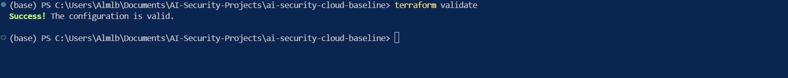
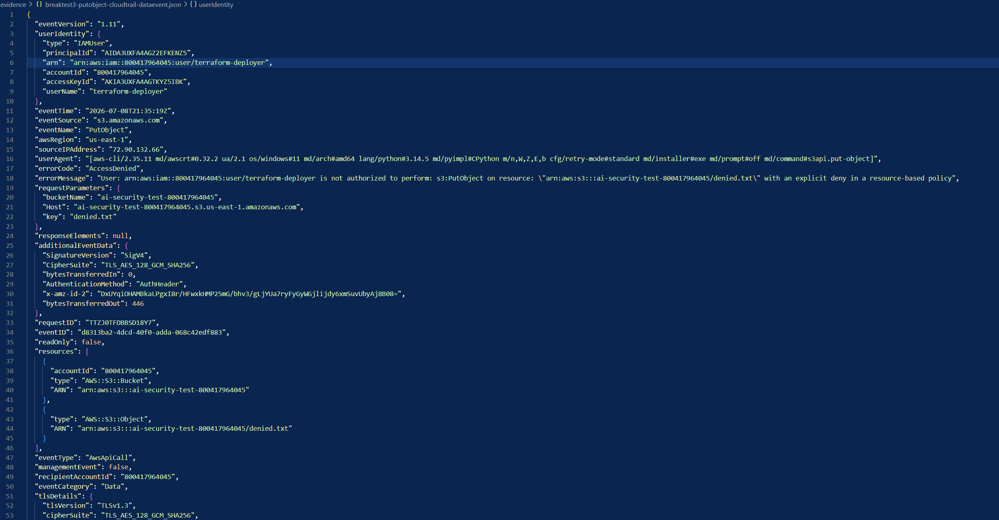

# AI Security Cloud Baseline

## Overview

This project implements a secure AWS cloud baseline for AI workloads using Terraform.

The goal of this project is to build the cloud security foundation required before deploying LLM applications, RAG systems, AI agents, or Bedrock-based workloads in AWS.

This baseline focuses on:

- Identity boundaries
- Least privilege IAM
- Encryption by default
- Secrets management
- CloudTrail audit logging
- CloudWatch visibility
- VPC egress restriction
- Secure account defaults
- Cost anomaly detection
- Continuous compliance monitoring
- Threat detection with GuardDuty
- Break/fix security validation

This project was built as a production-style security engineering lab and validated through controlled testing.

---

## Why This Project Matters

AI workloads introduce new cloud security risks.

A compromised AI agent, LLM-backed application, or automation workflow may attempt to:

- Access sensitive S3 data
- Retrieve secrets
- Abuse Bedrock model invocation
- Generate excessive cloud cost
- Write unencrypted data
- Move laterally using IAM permissions
- Disable logging or monitoring
- Exfiltrate data over unrestricted egress paths
- Create cloud resources that drift away from security standards

This baseline reduces those risks by enforcing secure cloud guardrails before AI workloads are deployed.

---

## Architecture Summary

The baseline is built around a restricted AI workload role.

The workload role is allowed to perform only approved actions required for AI workload execution, such as:

- Bedrock model invocation
- S3 object read/write
- Secrets Manager read access
- KMS decrypt and data key generation
- CloudWatch log stream creation
- CloudWatch log event publishing

Administrative actions such as IAM user creation, unrestricted role assumption, CloudTrail stop logging, and unrestricted public network egress are denied or restricted.

The hardened layer adds continuous monitoring through AWS Config and GuardDuty.

---

## Controls Implemented

| Module | Control | Purpose |
|---|---|---|
| Module 1 | IAM Permission Boundary | Restricts AI workload permissions to approved actions |
| Module 2 | KMS Key Separation | Creates separate encryption keys for logs, secrets, and storage |
| Module 3 | Secrets Manager | Stores application secrets using KMS encryption |
| Module 4 | CloudTrail | Enables management and data event logging |
| Module 5 | VPC + Egress Allowlist | Restricts outbound traffic and supports private Bedrock access |
| Module 6 | CloudWatch Logs | Creates encrypted log groups for app, model, and tool telemetry |
| Module 7 | Account Defaults | Enables S3 public access block and EBS encryption by default |
| Module 8 | Budgets + SNS + Cost Anomaly Detection | Detects cost spikes, agent loops, and runaway usage |
| Hardening | AWS Config + GuardDuty | Adds continuous compliance monitoring and threat detection |

---

## Build It Validation

The baseline was deployed using Terraform modules.

Core build validation included:

- Terraform initialization
- Terraform formatting
- Terraform validation
- Terraform apply
- Terraform state verification
- AWS CLI service validation
- Post-deployment evidence capture

The build phase confirmed that the baseline resources were successfully deployed and visible in Terraform state.

---

## Break/Fix Validation

The baseline was validated through controlled break/fix testing.

| Test | Objective | Expected Result | Status |
|---|---|---|---|
| Break Test 1 | Unexpected AssumeRole attempt | AccessDenied and CloudTrail visibility | Completed |
| Break Test 2 | Leaked-key simulation | CreateAccessKey and DeleteAccessKey visible in CloudTrail | Completed |
| Break Test 3 | PutObject without server-side encryption | AccessDenied and S3 data event captured | Completed |
| Break Test 4 | Stop CloudTrail from workload role | ExplicitDeny from Permission Boundary | Completed |

The break/fix testing proved that the controls were not only deployed, but enforceable.

---

## Harden It Validation

After completing the break/fix tests, the baseline was hardened with continuous monitoring and detection controls.

| Hardening Control | Purpose | Status |
|---|---|---|
| AWS Config S3 Encryption Rule | Detects S3 buckets without server-side encryption | Active |
| AWS Config S3 Public Read Rule | Detects S3 buckets that allow public read access | Active |
| GuardDuty Detector | Enables AWS threat detection for suspicious account activity | Enabled |
| GuardDuty to SNS Event Rule | Routes GuardDuty findings into the shared alert channel | Enabled |

The hardening phase moves the baseline from point-in-time deployment security to continuous security monitoring.

### Production Value

This hardening layer helps detect:

- S3 buckets created after deployment without encryption
- S3 buckets that allow public read access
- Suspicious AWS account activity
- GuardDuty findings that need to be routed to the security alert channel
- Security drift after the original Terraform deployment

This completes the Chapter 5 flow:

```text
Build It → Break It → Harden It
````

---

## Key Security Outcomes

This project validates the following security outcomes:

* AI workload role is restricted by IAM Permission Boundary
* Unauthorized role assumption attempts are denied
* IAM access key lifecycle activity is visible in CloudTrail
* Unencrypted S3 object uploads are blocked
* S3 data events are captured for investigation
* CloudTrail cannot be stopped by the AI workload role
* CloudTrail remains enabled after testing
* S3 public access is blocked at the account level
* EBS encryption is enabled by default
* Cost monitoring is enabled through Budgets and Cost Anomaly Detection
* AWS Config rules monitor S3 encryption and public read exposure
* GuardDuty is enabled for AWS threat detection
* GuardDuty findings are routed to the shared alert channel
* Terraform plan validation confirms infrastructure alignment after testing

---

## Evidence and Documentation

Raw evidence files are not published because they may contain account-specific metadata, ARNs, access key identifiers, CloudTrail payloads, bucket names, detector IDs, or IAM usernames.

Redacted evidence summaries are available in:

* `evidence-redacted/`
* `security-notes/`
* `screenshots-redacted/`

Current redacted evidence includes:

* Break/fix validation summary
* Harden It validation summary
* Control map
* Threat model
* Lessons learned

---

## Screenshots

Screenshots are stored in:

```text
screenshots-redacted/
```

Recommended screenshots for this project:

### Terraform Validation



### IAM Permission Boundary Explicit Deny


### CloudTrail Logging Enabled


### S3 PutObject AccessDenied



### AWS Config Rules Active


### GuardDuty Detector Enabled


### GuardDuty EventBridge Rule


---

## Tools Used

* AWS CLI
* Terraform
* IAM
* KMS
* Secrets Manager
* CloudTrail
* CloudWatch Logs
* S3
* VPC
* SNS
* AWS Budgets
* Cost Anomaly Detection
* AWS Config
* GuardDuty
* EventBridge
* GitHub

---

## Repository Structure

```text
ai-security-cloud-baseline/
├── architecture/
├── evidence-redacted/
│   ├── break-fix-validation.md
│   └── harden-it-validation.md
├── modules/
│   ├── account_defaults/
│   ├── budgets/
│   ├── cloudtrail/
│   ├── config/
│   ├── iam/
│   ├── kms/
│   ├── logs/
│   ├── secrets/
│   └── vpc/
├── screenshots-redacted/
├── security-notes/
│   ├── control-map.md
│   ├── lessons-learned.md
│   └── threat-model.md
├── .gitignore
├── main.tf
├── variables.tf
└── README.md
```

---

## Production Risks Reduced

This baseline helps reduce:

* Privilege escalation
* Over-permissioned AI workload roles
* Credential misuse
* Unencrypted storage
* Public S3 exposure
* Logging tampering
* Weak incident evidence
* Data exfiltration
* Runaway AI workload cost
* Lack of AI workload auditability
* S3 security drift after deployment
* Missing threat detection for suspicious AWS activity

---

## Lessons Learned

Key lessons from this project:

1. IAM Permission Boundaries are strong blast-radius controls.
2. Trust policies and Permission Boundaries solve different security problems.
3. S3 data events must be handled differently than CloudTrail management events.
4. Cost monitoring is a security control for AI workloads.
5. Break/fix validation creates stronger evidence than deployment alone.
6. AWS Config is needed to detect security drift after deployment.
7. GuardDuty adds detective coverage for suspicious AWS activity.
8. Security baselines should include both preventive and detective controls.

---

## Resume Summary

Built and validated a Terraform-based AWS cloud security baseline for AI workloads, implementing IAM Permission Boundaries, KMS encryption, Secrets Manager, CloudTrail management/data events, CloudWatch logging, VPC egress restrictions, S3/EBS secure defaults, AWS Budgets, SNS alerts, Cost Anomaly Detection, AWS Config rules, and GuardDuty detection routing. Performed break/fix testing and captured redacted evidence to prove controls were enforceable.

---

## Disclaimer

This project was built in a personal AWS lab environment for security engineering practice.

Do not run these controls against a production AWS account without proper review, change control, cost review, security review, and environment-specific adjustments.

````

